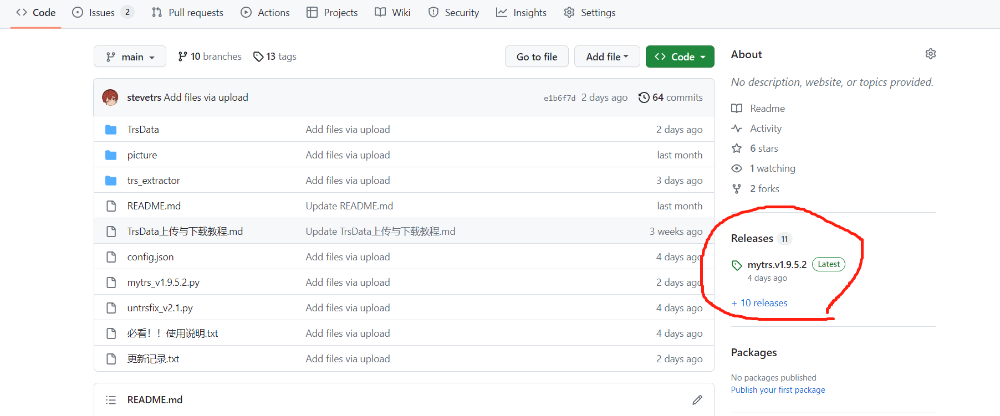
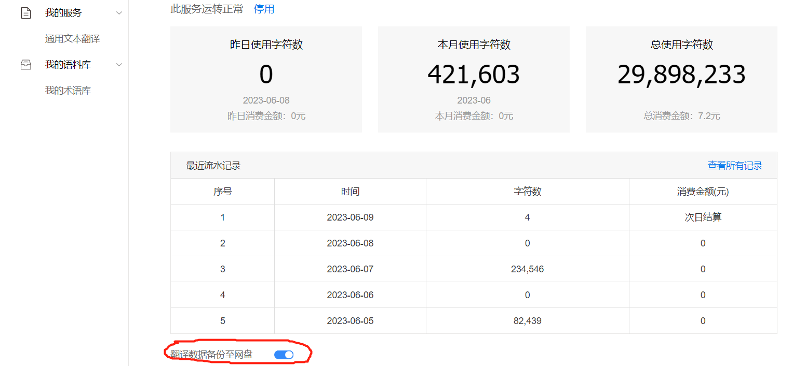

## 一些tips

### 1.如何从github上下载内容
发现有些人不知道怎么从github下载东西，github上所有的发布内容都集中在release里面，从图示位置进入。

### 2.关于防止翻译数据丢失

首先，在正常的已发布版本中，我从未遇到保存失败的情况；其次，工具内已经做好了充足的防范措施，如果真的保存失败，会将所有数据原封不动的保存在Excel文件中。手动处理后就能继续使用。再次，如果对本工具实在不放心，请打开百度翻译的自动备份功能。具体方法为，打开百度翻译控制台，拉到图示位置，打开自动备份功能。

打开后，所有的翻译数据会每隔几个小时自动上传云端，可以在百度云app的“全部工具”→“智能设备”中查看。

这些数据同样通过手动处理后即可使用。任何人使用本工具过程中，遇到了需要手动处理数据的情况，都可以把这些数据发给我，在我有心情有时间的情况下，可以帮你们处理一下。

再此基础上，如果你还是无法信用本工具，请不要使用。

### 3.你们使用本工具，我本人无法从中获取任何利益。

使用过程中遇到任何问题、bug，欢迎联系我，但是态度好点，我不欠你们的。

### 4.qq群

新建QQ群：852682626，仅用于技术交流和机翻文件分享，禁止涉黄涉政等一切非法行为。

欢迎来水群，使用工具过程中有任何疑问也可以来这提问。

# mytrs

mytrs为用于搭配mtool来机翻RPGMaker等引擎制作的游戏的工具，可用于翻译任意符合格式要求的文本文件。特点是翻译速度快，~~测试不足，bug多~~
## 工具功能介绍
本工具目前支持百度、彩云、小牛三种翻译引擎，支持的文件格式为json格式：

    {
        "原文1":"原文1（翻译后对应译文）",
        "原文2":"原文2",
        ...,
        "原文n":"原文n"
    }

工具会自动识别文件名称为ManualTransFile.json的文件进行翻译，并将翻译结果以json格式保存为TrsData.bin中。系统配置储存在配置文件config.json中，用户需自行设置。

以行为单位，当源语言为非英文时，能自动剔除文本中仅含英文和特殊符号的字符串，以节省翻译引擎流量。特殊符号的范围可在配置文件中自行删改。

能自动记录利用本工具所消耗的字符量流量（usage），并在每月初流量重置时重置所记录的usage。当usage接近上限（limits）时自动停止翻译并分别导出翻译结果和未翻译部分。

当配置文件中包含多个翻译引擎时，自动按顺序使用这些翻译引擎，并分别记录usage。

翻译时可按字符串长短排序，按从长到短的顺序进行翻译，以便优先使用效果好的翻译引擎翻译较长（通常也是较为重要）的文本。

支持本地字词库，实现原理是在翻译前以字词库中对应的译文替换原文中相应的部分，并在翻译后将原文复原，~~经过测试，效果极差~~,字词库与ManualTransFile.json使用相同的格式，且存在先后顺序，从上到下依次进行替换。目前不支持多个原文对应同一译文，会导致复原原文时出现错误。

## 使用方法：
确保在同一目录下存在config.json和ManualTransFile.json，如果要使用字词库，确保字词库也在此目录，然后运行mytrs.py或mytrs.exe即可，运行py文件须确保已安装所需的库。配置文件说明详见压缩包内“必看！！使用说明.txt”文件

翻译结果会自动保存在TrsData.bin内，如果存在翻译失败的文本，会保存在error.json内。如果翻译引擎报错，会自动停止使用此引擎，并切换到下一个引擎。若当前流量不足以完整此翻译文件，会将已翻译的部分保存为TrsData.bin，未翻译部分保存为untrsed.json。如果文件保存失败，会将数据以原本的格式（pandas的DataFrame）保存在对应文件名+_fail.txt内。

如果遇到任何bug、闪退，或非mtool原因的大面积漏翻，请上报于我。
## 更新记录
v1.9.8(2023.6.14):

(需更新config)更新config方法：按照已有格式，把config新增项放在任意位置即可，所有数据类型的注意最后一行不要有逗号

config新增项：

    {
        "src_rep": 数字,
        "dst_rep": 数字,
        "backupengine": [
            "caiyun",
            "xiaoniu"（比如说这里就没有逗号）
        ](全文件的末尾也没有逗号）
    }
 
1.增加全新功能，能处理翻译结果中有大量连续重复字符时的情况，比如这种

    "「――ひぃぃあぁぁあッ！！」": "“——啊啊啊啊啊！！”",
    
    "「おっせーなーサオリの奴\nどこまでオヤツ買いに行ったんだ？」": "“喂喂喂喂喂喂喂喂喂喂喂喂喂喂喂喂喂喂喂喂喂喂喂喂喂喂喂喂喂喂喂喂喂喂喂喂喂喂喂喂喂喂喂喂喂喂喂喂喂喂喂喂喂喂喂喂喂喂喂喂喂喂喂喂喂喂喂喂喂喂喂喂",
    
    "なあスケベしようか": "喂喂喂喂喂喂喂喂喂喂喂喂喂喂喂喂喂喂喂喂喂喂喂喂喂喂喂喂喂喂喂喂喂喂喂喂喂喂喂喂喂喂喂喂喂喂喂喂喂喂喂喂喂喂喂喂喂喂",
    
处理方法为，在全部翻译完成后，遍历整个trsdata，将译文中有连续重复dst_rep个以上的文字，并且原文中连续重复文字不超过src_rep个的文本重新用"backupengine"中的引擎依次重新翻译一遍。如果到最后仍有这种文本，会导出为repeat.json文件以供手动处理，如果"backupengine"是空的（[]），就只会导出异常文本。

应用示例：

正常用baidu翻译了全部文本，然后判断到出现了异常文本，会先用"backupengine"中的第一个引擎，比如说caiyun，对这些
文本重新翻译，翻译后，如果还存在，就继续用第二个引擎xiaoniu再翻译一次，如果还有，导出剩余的异常文本

v1.9.7(2023.6.13):

1.修复了cleaner工作时会跳过最后一行字符串的bug（很好奇当时我是出于什么想法才再循环上加了个-1的）

2.修复了报错或字符数不足时，在TrsData内会有一行未翻译数据的问题

3.添加了工具图标

v1.9.6(2023.6.12):

1.cleaner开始使用正则表达式判断，不再需要手动列举特殊字符了，并且添加英文模式

现在的cleaner工作逻辑为：

日文模式下，会自动剔除所有不含日文假名的字符串（只有日文汉字的也会被剔除）

英文模式下，会自动剔除所有不含大小写字母的字符串（换行符\r等不会被认作是字母）

untrsfix同步更新，在没有config文件时，默认是日文模式

v1.9.5.2(2023.6.5):

1.用来替换\r\n的分隔符，现在可以在config里自由调整了

2.导出失败时，将数据输出改为Excel文件

~~v1.9.5(2023.6.4):~~

~~1.更新剔除中文的功能，只在cleaner开始时工作。目的为剔除trs_extractor处理后，残留的部分已汉化文本，推荐平时关闭，因为它也会将日文汉字识别为中文。~~已回退

v1.9.4(2023.5.11):

1.现在文本过长也不会返回空参数了，但是如果超出引擎限制，可能会返回其他错误代码（每次请求的第一行字符串会无视NPQ的限制进行翻译）

v1.9.3（2023.5.10）：

1.现在会输出完整的报错信息了，方便各位上报bug，也方便我筛查问题所在

v1.9.2（2023.5.7）：

1.修复了会遍历整个enginelist，重复翻译的问题

v1.9.1（2023.5.7）:

1.更新了百度api的请求网址

v1.9（2023.4.24）:

1.config添加一项"cleaner"，用于开关cleaner功能，0关闭，1开启。对于英文翻译，不能使用cleaner功能，用了的话会把英文文本全部删除，以前没注意到。并将进行判断的特殊字符放在了config的"special"中，可自行删改;

2.优化了每次请求中字符量（NPQ）的判断，现在每次请求一定不会超过NPQ了，同时对limits的判断也更为精确，实际消耗会控制在limits-NPQ左右;

3.修正了在1.7和1.8更新后发现的bug。

v1.8（2023.4.24）:

1.现在在翻译前会先依照文本长短进行排序，优先翻译长文本，因为长文本大概率是剧情文本，这样在翻译引擎字数不足时，这些文本会被优先翻译。

在这种情况下，推荐将翻译效果好的引擎放在enginelist的前面，一种进阶玩法是，手动调整limits的大小，达到用效果比较好的翻译引擎将大部分剧情文本
翻译后，用效果差的翻译引擎去翻译那些不重要的文本。（怎么可能有人能靠手动设置做到这个-_-,用代码比较好的实现这个效果的方法我也没想到，以后再说吧）
（其实这个功能是想用在chatgpt上的，奈何gpt没有免费额度，只能作罢。）

v1.7（2023.4.24）:

1.更换了分隔每行字符的分隔符（从“S/som”换成了“↑☆↓☆”），消除了可能的对英文翻译的影响；

2.现在能够自动记录api通过本工具消耗的总字符量，并且每月初自动重置；

3.删除了config.json中‘engine’项，改为按‘enginelist’中的先后顺序，按顺序使用翻译引擎，当前一个引擎字数达到上限后，自动更换到下一个引擎
若所有引擎的总余量仍不足以翻译整个文件，则会在翻译前提示，并在翻译后将已翻译部分和未翻译部分分别保存在TrsData.bin和untrsed.json中，
配置文件config.json的说明已在“必看！！使用说明.txt”中更新。

v1.6:

1.大概率修正了彩云吞换行符的问题。

v1.5：

1.因为百度翻译存在奇怪的bug且找不到原因，直接修改了整个框架，现在的框架比以前的更合理了;

2.修正了换行符只考虑到\n而没考虑到\r的问题;

3.修正了读取文件失败后闪退的问题（应该停留在报错界面）;

4.修正了字词库替换原文后没有替换回来的问题。
## others
本人非相关专业学生/从业者，如果你看我的代码难受，你自己来。

可考虑接入ChatGpt进行翻译，但因为Gpt api没有免费用户计划，所以目前本人没有接入的计划。
