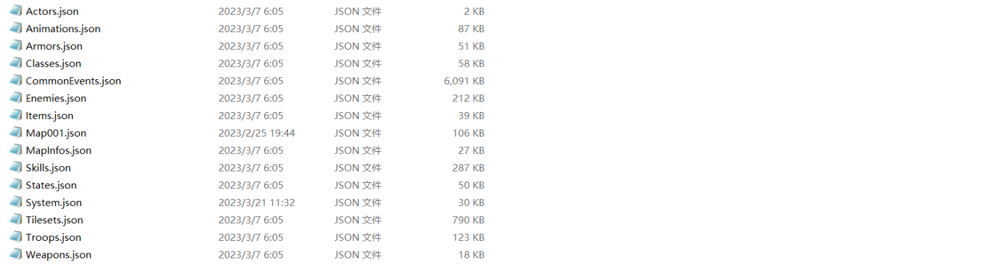
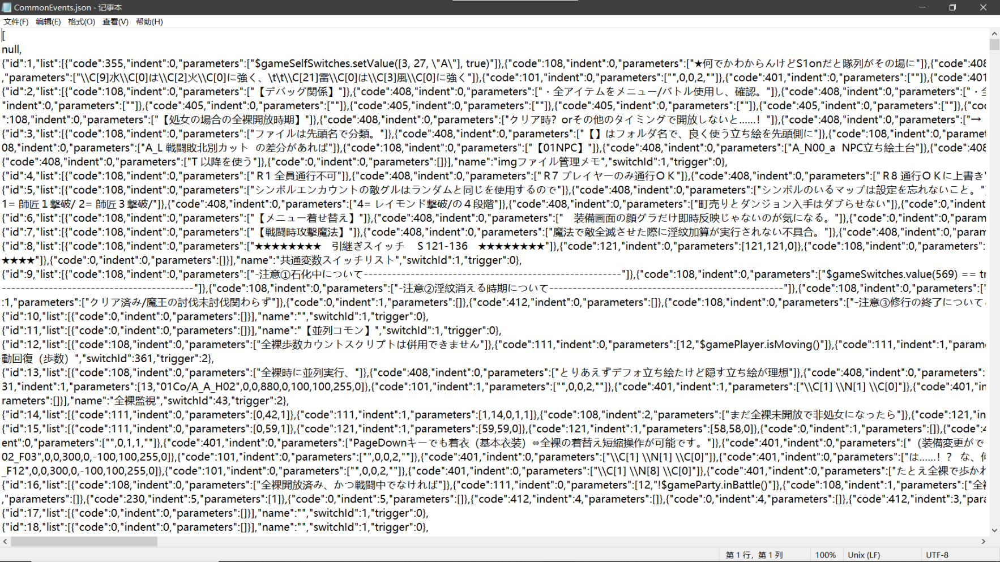
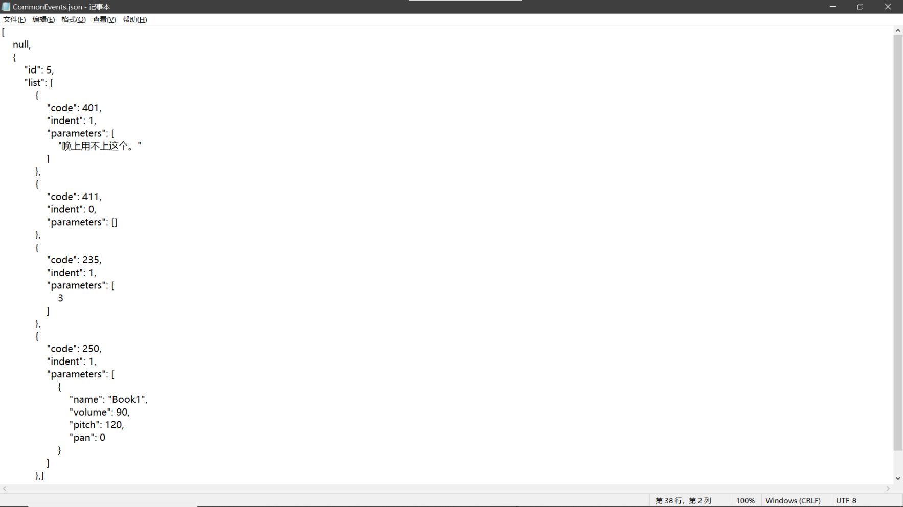

首先打开游戏的data文件夹，我们会看到这几类文件

经过我的初步观察，它们应该分别对应：角色、动画、护甲、角色职业、通用活动（通常是cg）、敌人、道具、地图、地图信息、技能、角色状态（debuff，buff）、系统、？、战斗内信息（包含了战斗内对话内容）和武器。

其中比较重要的是CommonEvents，MapXXX（编号，通常会有很多个）和Troops文件，分别包含了cg文本，各个地图内的剧情文本和战斗内文本。

随意打开一个文件，我们会看到这种玩意

很难从中提取到任何信息，但它是一个json文件，只需要简单整理一下就能从中提取出剧情文本。整理之后，以CommonEvents为例，具有这种格式

如果用python来读取这个文件的话，那么他就是一个list内包含在多个dict的数据形式。其中"parameters"包含了包括文本数据在内的很多数据。那么我们就可以利用除文本数据以外的所有数据作为索引，去找到新版游戏中对应这句译文的原文，然后将它替换成已知的原文。

不同文件内的数据格式都稍有区别，但都可以用相同的方法提取到原文对应的译文。所以我们要做的就是，遍历已汉化旧版游戏，和未汉化新版游戏的data文件夹，将新版游戏内的所有能够与旧版游戏对应上的文本数据做替换。

替换完成后，我们就得到了一份包含有旧版大部分已汉化文本的新版游戏，接下来我们需要做的，便是将新版本新增文本用机翻补全：利用mtool将新旧两个版本的“待翻译文件”提取出来，把旧版本的待翻译文件改名为TrsData.bin，然后利用我做的untrsfix，就可以提取出新版游戏新增的文本了，之后就是常规的机翻，导入翻译文件了。
